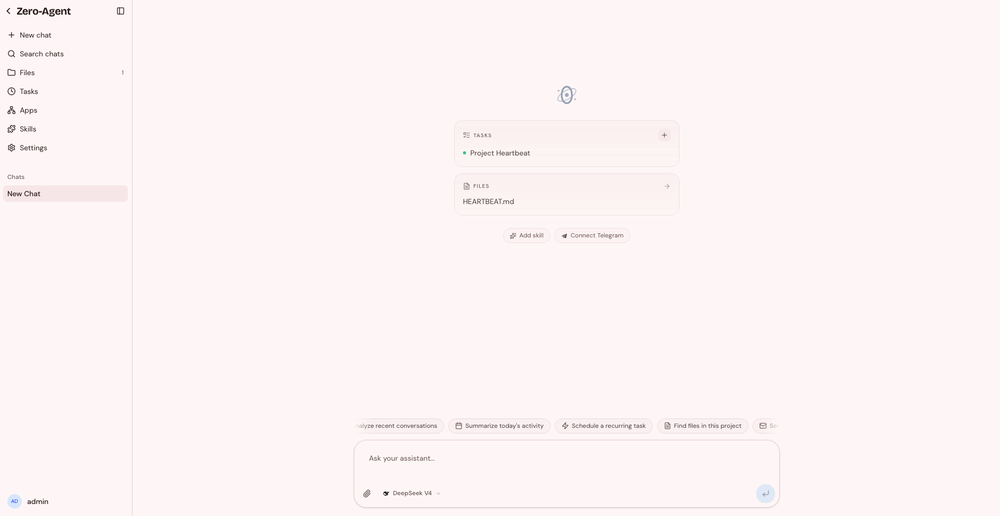

<p align="center">
  
</p>

<h1 align="center">Zero Agent</h1>

<p align="center">
  <strong><a href="https://github.com/badlogic/pi-mono">Pi</a> with a collaborative web UI. Self-hosted, multi-user, autonomous.</strong>
</p>

<p align="center">
  <a href="https://zero-agent.cero-ai.com">Website</a> ·
  <a href="#quick-start">Quick Start</a> ·
  <a href="#features">Features</a> ·
  <a href="https://github.com/0-AI-UG/zero-agent/issues">Issues</a>
</p>

<p align="center">
  <a href="https://github.com/0-AI-UG/zero-agent/blob/main/LICENSE"></a>
  <a href="https://github.com/0-AI-UG/zero-agent/stargazers"></a>
  <a href="https://github.com/0-AI-UG/zero-agent/releases"></a>
</p>

---

<p align="center">
  
</p>

## What is this?

Zero Agent takes [**Pi**](https://github.com/badlogic/pi-mono), an open agentic coding runtime, and wraps it in a **collaborative web UI** for teams.

You get Pi's coding agent (real tool-use protocol, streaming, reasoning, subagents) running on a **persistent project filesystem** that your whole team shares with the agent in real time. On top of that, Zero adds the pieces an agent needs to actually be useful day-to-day:

- a **`zero` CLI** the agent calls from bash: browser, web search, email (IMAP+SMTP), image generation, credentials vault, scheduled tasks, app preview URLs, embeddings;
- **autonomy**: cron + file/message event triggers with cycle guards, a per-project `HEARTBEAT.md` loop, and a Telegram bridge where replies feed back into the same chat;
- **per-turn git snapshots** so every change is reversible at file granularity;
- an **OS-level sandbox** (`bubblewrap` / `sandbox-exec`) plus passkey auth, encrypted credentials, and a Unix-socket proxy for subprocess callbacks.

Self-hosted. Multi-user. Runs unattended.

## Quick Start

```bash
git clone https://github.com/0-AI-UG/zero-agent.git
cd zero-agent && bun install

cp .env.example .env   # add OPENROUTER_API_KEY, generate JWT_SECRET + CREDENTIALS_KEY
bun run dev
```

Open [localhost:3000](http://localhost:3000). Or run with Docker:

```bash
docker compose up
```

Requires [Bun](https://bun.sh) v1.3+ and Node.js 20+.

### Run the prebuilt image (no clone)

Every push to `main` publishes `ghcr.io/0-ai-ug/zero-agent/server:latest` to GitHub Container Registry. To run it without cloning the repo:

```bash
docker run -d --name zero-agent \
  -p 3000:3000 \
  -v zero-data:/app/data \
  -v zero-projects:/var/zero \
  --env-file .env \
  --memory 1200m --memory-swap 1200m \
  --restart unless-stopped \
  ghcr.io/0-ai-ug/zero-agent/server:latest
```

The two volumes are required — `zero-projects` (`/var/zero`) holds workspaces and per-chat session history, so projects survive restarts. Supply secrets via `--env-file .env` (see [Configuration](#configuration)).

The same image backs `docker-compose.yml`, so `docker compose pull` fetches it instead of building from source.

## Features

**From Pi (embedded in-process):**
- Real tool-use protocol with streaming, reasoning, and parallel/chained subagents.
- Coding agent (read, write, edit, bash, grep) with session JSONL persistence.

**What Zero adds on top:**
- **Collaborative web UI.** Multiple users in the same project, live presence, typing indicators, and tool-call streaming over WebSocket.
- **Persistent project filesystem.** Real working directories under `/var/zero` that the agent picks up across sessions.
- **`zero` CLI.** The agent's bash gateway to a headless browser pool, web search, email (IMAP + SMTP), image generation, credentials, scheduled tasks, proxied app preview URLs, and embeddings.
- **Autonomy.** Cron schedules, file/message event triggers with cooldowns and cycle guards, a per-project `HEARTBEAT.md` loop, and a Telegram bridge that posts replies back into the originating chat.
- **Reversible by turn.** Per-turn git snapshots in a hidden `.git-snapshots` dir; revert one file from one turn without resetting the chat.
- **Safe to leave alone.** OS-level sandbox (`bubblewrap` / `sandbox-exec`), passkey auth, AES-encrypted credential vault accessed via shell substitution (never in the transcript), and a per-turn Unix-socket proxy for subprocess callbacks.

## How it compares

|  | OpenWebUI · LibreChat | Dify · Langflow | OpenHands | AnythingLLM | **Zero Agent** |
|---|---|---|---|---|---|
| Persistent project filesystem | – | – | per-session | – | **Yes** |
| Multi-user on same workspace | per-user chats | per-app | single-user | per-workspace docs | **Shared + presence** |
| Per-turn snapshots & revert | – | – | – | – | **Yes** |
| OS-level sandbox | – | – | Docker | – | **bwrap / sandbox-exec** |
| Scheduled + event autonomy | – | partial | – | – | **Yes** |

## Configuration

| Variable | Description |
|---|---|
| `OPENROUTER_API_KEY` | Required. [OpenRouter](https://openrouter.ai) key. |
| `JWT_SECRET` · `CREDENTIALS_KEY` | Required. ≥32 chars each (`openssl rand -hex 32`). |
| `BRAVE_SEARCH_API_KEY` | Optional. Web search. |
| `APP_URL` · `RP_ID` · `CORS_ORIGIN` · `TRUST_PROXY` | Set in production. |

Models, image providers, and per-user limits are configured at runtime via the admin panel.

## Tech Stack

[Pi](https://github.com/badlogic/pi-mono) · [OpenRouter](https://openrouter.ai) · [`@anthropic-ai/sandbox-runtime`](https://www.npmjs.com/package/@anthropic-ai/sandbox-runtime) · Node 20 · SQLite + [`s3lite`](https://github.com/0-AI-UG/s3lite) · React 19 · Tailwind v4 · `rebrowser-playwright` · Passkeys

## Contributing

Issues and PRs welcome. Please open an issue before non-trivial changes.

## Star History

<a href="https://star-history.com/#0-AI-UG/zero-agent&Date">
  
</a>

## License

[MIT](LICENSE)
