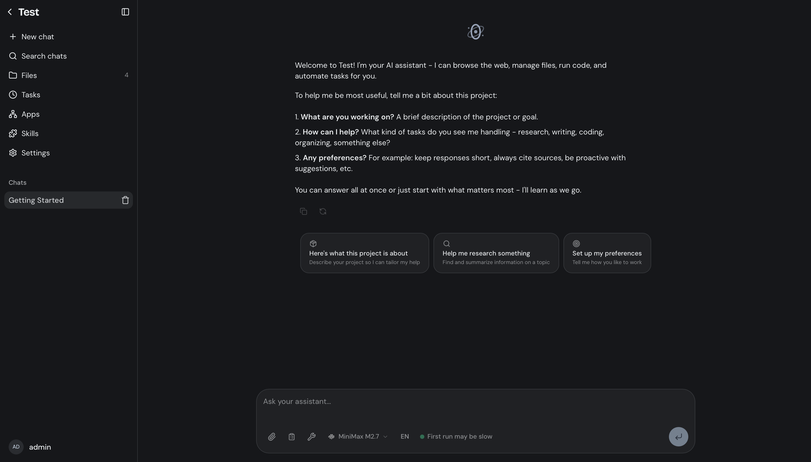

<p align="center">
  
</p>

<h1 align="center">Zero Agent</h1>

<p align="center">
  <strong>Self-hosted AI agent platform for teams.</strong><br>
  Chat, browse the web, execute code, manage files, automate tasks — with any model.
</p>

<p align="center">
  <a href="https://zero-agent.cero-ai.com">Website</a> ·
  <a href="#quick-start">Quick Start</a> ·
  <a href="#features">Features</a> ·
  <a href="https://github.com/0-AI-UG/zero-agent/issues">Issues</a> ·
  <a href="https://github.com/0-AI-UG/zero-agent/discussions">Discussions</a>
</p>

<p align="center">
  <a href="https://github.com/0-AI-UG/zero-agent/blob/main/LICENSE"></a>
  <a href="https://github.com/0-AI-UG/zero-agent/stargazers"></a>
  <a href="https://github.com/0-AI-UG/zero-agent/releases"></a>
  <a href="https://github.com/0-AI-UG/zero-agent/issues"></a>
</p>

<p align="center">
  
</p>

## Quick Start

**Prerequisites:** [Bun](https://bun.sh) v1.3+, [Docker](https://docs.docker.com/get-docker/)

```bash
git clone https://github.com/0-AI-UG/zero-agent.git
cd zero-agent
bun install

cp .env.example .env
# Add your OPENROUTER_API_KEY to .env

bun run dev
```

Open [http://localhost:3000](http://localhost:3000) and complete the setup wizard.

### Docker Compose

```bash
docker compose up
```

| Service | Port | Description |
|---|---|---|
| **server** | 3000 | API, web UI, agent orchestration |
| **runner** | 3100 | Container lifecycle, browser, code execution |

## Features

### 1. Chat with 100+ models

Streaming responses, tool use, and chain-of-thought reasoning powered by [OpenRouter](https://openrouter.ai). Switch models per message. One API key, every provider.

### 2. Sandboxed code execution

Every project gets an isolated Docker container with Python, Bun, git, and standard tooling. The agent writes and runs code in a real environment — not a toy interpreter.

### 3. Headless browser

Automated web browsing with Chromium and Chrome DevTools Protocol. Navigate pages, fill forms, take screenshots, and extract content — with stealth mode to bypass bot detection.

### 4. Web search

Integrated search via Brave Search API with automatic page content extraction and markdown conversion.

### 5. File management

Upload, organize, preview, and edit files with S3-compatible storage. Supports images, code, CSV, XLSX, JSON, PDF, and more. Includes semantic search (hybrid dense + sparse retrieval) across files and conversation history.

### 6. Image generation

Generate images through OpenRouter-supported models (FLUX and others) with customizable aspect ratios.

### 7. App deployment

Run containerized apps inside projects with automatic port detection and HTTP proxying. Build and preview web apps without leaving the chat.

### 8. Skills system

Extensible markdown-defined skill modules. Built-in skills include presentation builder, spreadsheet analyzer, and a skill creator for building your own.

### 9. Scheduled tasks & event triggers

Cron-based autonomous agents that run on a schedule. Event triggers react to file changes, new messages, and other project events with filters and cooldowns.

### 10. Parallel sub-agents

Spawn up to 5 sub-agents in parallel with live progress UI. Break complex tasks into concurrent work streams.

### 11. Plan mode

The agent writes a detailed plan for your review before executing. Approve, revise, or reject before any changes are made.

### 12. Persistent memory

Per-project `SOUL.md` (identity/instructions), `MEMORY.md` (facts and decisions), and `HEARTBEAT.md` (autonomous agent goals) — editable by both users and the agent.

### 13. Credential vault

Securely store usernames, passwords, and TOTP secrets for the agent to use during automated browsing and logins.

### 14. Multi-user projects

Workspaces with roles, invitations, and realtime presence. See who's online, who's typing, and collaborate on the same project.

### 15. Notifications

Web Push notifications and Telegram bot integration. Get notified when tasks complete, plans need review, or the agent needs approval.

### 16. Security

Passkey (WebAuthn) and TOTP 2FA authentication. JWT sessions with per-user token limits. Admin panel for user management, model configuration, and usage tracking.

## Configuration

Copy `.env.example` to `.env`:

| Variable | Required | Description |
|---|---|---|
| `OPENROUTER_API_KEY` | Yes | [OpenRouter](https://openrouter.ai) key — one credential, 100+ models |
| `BRAVE_SEARCH_API_KEY` | No | [Brave Search](https://brave.com/search/api/) key for web search |

Models, image providers, credentials, and per-skill settings are configured at runtime through the admin panel.

## Architecture

```
┌────────────────────────────────────────┐
│  Web Frontend (React 19)               │  :3000
│  Chat · Files · Tasks · Skills · Admin │
└──────────────┬─────────────────────────┘
               │
┌──────────────▼─────────────────────────┐
│  Server (Bun + SQLite)                 │  :3000
│  Agent loop · Scheduler · Triggers     │
│  Durability · RAG · Auth · Memory      │
└──────────────┬─────────────────────────┘
               │  HTTP
┌──────────────▼─────────────────────────┐
│  Runner (Bun + Docker)                 │  :3100
│  Container lifecycle · Bash · Browser  │
│  Workspace sync · Snapshots · Proxy    │
└──────────────┬─────────────────────────┘
               │
        Docker Engine
        └── Per-project session containers
            └── Chromium + Python + Bun
```

**Server** — Bun process serving API and frontend. SQLite (WAL mode) for relational data, S3-compatible storage for files and snapshots. Agents built on [AI SDK](https://ai-sdk.dev) with dynamic tool loading, checkpointing, and crash recovery.

**Runner** — Standalone Bun service managing Docker containers via Engine API. Provides bash execution, Chromium control (CDP), file I/O, workspace sync, snapshotting, and HTTP proxying.

**Frontend** — React 19 + Tailwind CSS v4 + shadcn/ui. TanStack Query for server state, Zustand for client state, React Router v7 for routing, WebSockets for realtime events.

## Tech Stack

| Layer | Technology |
|---|---|
| Runtime | [Bun](https://bun.sh) |
| AI | [AI SDK](https://ai-sdk.dev) + [OpenRouter](https://openrouter.ai) |
| Frontend | React 19, Tailwind CSS v4, shadcn/ui, TanStack Query, Zustand, React Router v7 |
| Database | SQLite (WAL mode) |
| Vectors | SQLite + HNSW via [`@0-ai/s3lite`](https://github.com/0-AI-UG/s3lite) |
| Storage | S3-compatible |
| Sandbox | Docker Engine API, Chromium + CDP |
| Auth | Passkeys (WebAuthn) + TOTP 2FA |
| Notifications | Web Push + Telegram |

## Project Structure

```
server/    Backend — API, agent loop, scheduler, auth, RAG
runner/    Sandbox service — containers, browser, code execution
web/       Frontend — React 19, Tailwind v4, shadcn/ui
zero/      CLI + SDK — the `zero` command agents call from bash
skills/    Built-in skills — presentation, spreadsheet, skill-creator
data/      Runtime data — SQLite, files, vectors
```

## Development

```bash
bun run dev              # Hot-reload dev server on :3000
bun run build            # Build frontend
bun run compile          # Full build — server binary + frontend assets
```

## Contributing

Contributions welcome — bug fixes, new skills, features, or docs. Please open an issue to discuss before sending a pull request.

1. Fork the repository
2. Create a feature branch (`git checkout -b feat/amazing-feature`)
3. Commit your changes
4. Open a Pull Request

## Star History

[](https://star-history.com/#0-AI-UG/zero-agent&Date)

## License

[MIT](LICENSE)
